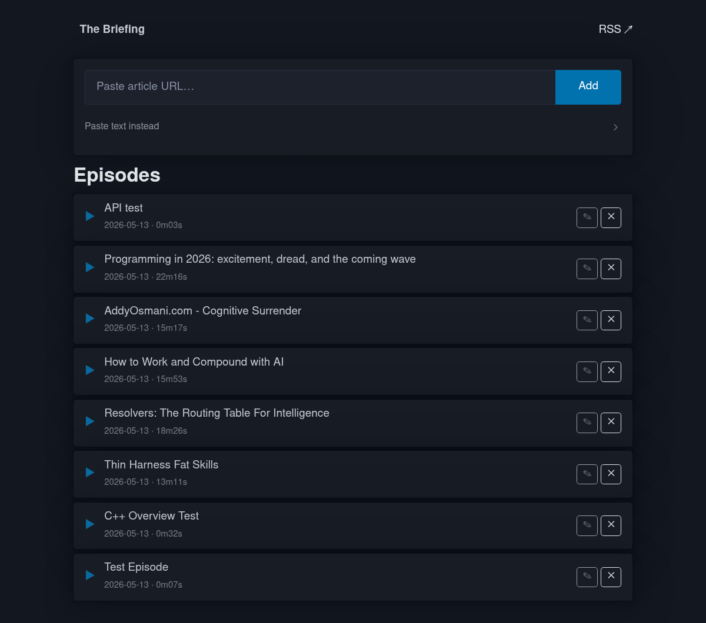
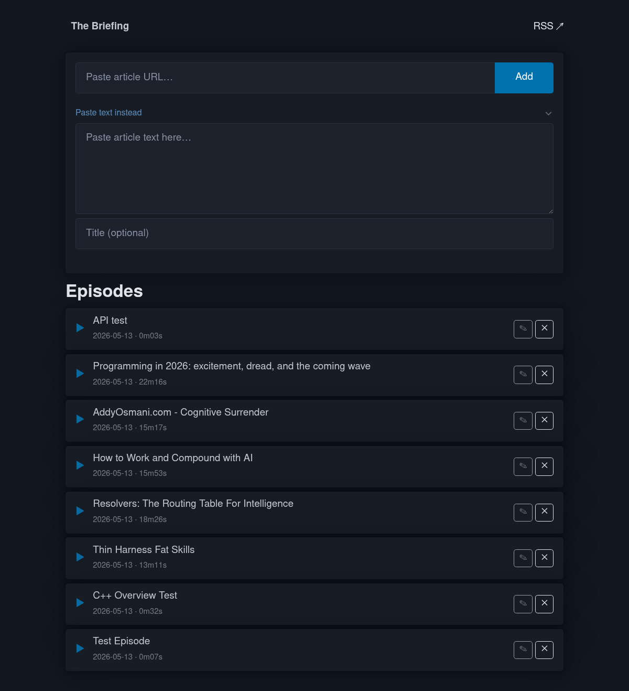

# TTS Podcast Service

A self-hosted pipeline that turns web articles and text into a private podcast feed you can subscribe to in Apple Podcasts (or any podcast app).

Submit a URL or paste text → Claude cleans it into a natural spoken transcript → Kokoro TTS synthesizes the audio → the episode appears in your podcast feed within minutes.



---

## How it works

```
URL / Text
    │
    ▼
[ingest.py]  ──── trafilatura / BeautifulSoup / Playwright (JS pages, X.com)
    │
    ▼
[transcript.py]  ── Claude Sonnet 4.6 rewrites for natural speech
    │               (removes markdown, URLs, code blocks; fixes pronunciation)
    ▼
[synthesize.py]  ── Kokoro 82M TTS on CUDA (25x real-time on GTX 1650)
    │               chunks text → WAV → 128kbps MP3
    ▼
[podcast.py]  ───── episodes.json + RSS 2.0 feed (iTunes namespace)
    │
    ▼
[server.py]  ────── Flask/gunicorn at :5050
                    /feed.rss   ← subscribe in Apple Podcasts
                    /           ← web UI for submissions & management
                    /api/episodes ← JSON API for external agents
```

Multiple submissions queue for the GPU automatically — ingest and transcription run concurrently, synthesis serializes so only one job uses the GPU at a time.

---

## Features

- **Web UI** — submit URLs or paste text from any device on your LAN; live progress card while processing; inline episode title editing; one-click delete
- **CLI** — `narrate add --url <url>` for scripted use; `narrate list/delete/edit`
- **X.com articles** — headless Chromium with saved session cookies for JS-rendered and login-walled content
- **JSON API** — `POST /api/episodes` with Bearer auth for automated agents (daily brief, etc.)
- **Apple Podcasts compatible** — RSS 2.0 with full iTunes namespace, episode artwork, and show notes from the transcript
- **Background synthesis** — terminal/browser returns immediately after the transcript step; synthesis continues in a background process

---

## Requirements

- Python 3.12 (Kokoro requires < 3.13)
- CUDA-capable GPU (CPU works but is ~25x slower)
- ffmpeg (WAV → MP3 conversion)
- Anthropic API key

### Python dependencies

```
pip install -r requirements.txt
```

Key packages: `kokoro`, `torch` (cu121), `anthropic`, `flask`, `gunicorn`, `trafilatura`, `playwright`, `feedgen`, `pydub`, `mutagen`, `soundfile`

---

## Setup

### 1. Clone and create venv

```bash
git clone https://github.com/bronco21016/TTS-podcast-service
cd TTS-podcast-service
python3.12 -m venv .venv
source .venv/bin/activate
pip install -r requirements.txt
pip install torch --index-url https://download.pytorch.org/whl/cu121
playwright install chromium
```

### 2. Configure `.env`

Copy the example and fill in your values:

```bash
cp .env.example .env
```

```env
ANTHROPIC_API_KEY=sk-ant-...
TTS_BASE_URL=http://192.168.1.x:5050   # your LAN IP
TTS_API_KEY=your-random-secret-here    # for the /api/episodes endpoint
```

Generate a random API key: `python -c "import secrets; print(secrets.token_urlsafe(32))"`

### 3. Edit config.py (optional)

```python
PODCAST_TITLE  = "The Briefing"    # name shown in podcast apps
PODCAST_AUTHOR = "Your Name"
PODCAST_EMAIL  = "you@example.com"
```

### 4. Add cover art

Drop a `cover.png` (square, 1400×1400 recommended) in the project root.

### 5. Install and start the systemd service

```bash
sudo cp tts-server.service /etc/systemd/system/
sudo systemctl daemon-reload
sudo systemctl enable --now tts-server
```

Or run directly for testing:

```bash
gunicorn --workers 2 --bind 0.0.0.0:5050 server:app
```

### 6. Subscribe in Apple Podcasts

Settings → Add a Podcast by URL → `http://<your-LAN-IP>:5050/feed.rss`

---

## Usage

### Web UI

Open `http://<your-LAN-IP>:5050` in any browser. Paste a URL and hit **Add**.



The progress card polls every 3 seconds and shows which stage is running (fetching → Claude → waiting for GPU → synthesizing chunk N/M). When synthesis finishes the card disappears and the episode drops into the list.

### CLI (`narrate`)

Install the wrapper on PATH:
```bash
echo 'exec /path/to/TTS_service/.venv/bin/python /path/to/TTS_service/cli.py "$@"' > ~/.local/bin/narrate
chmod +x ~/.local/bin/narrate
```

```bash
narrate add --url https://example.com/article
narrate add --file article.txt --title "My Title"
narrate list
narrate delete 3          # by number from list
narrate delete abc123     # by ID prefix
narrate edit 2 --title "Better Title"
narrate check-x           # check X.com session expiry
```

### JSON API

For external agents (daily brief, automation, etc.):

```bash
curl -X POST http://<host>:5050/api/episodes \
  -H "Authorization: Bearer <TTS_API_KEY>" \
  -H "Content-Type: application/json" \
  -d '{
    "title": "Daily Brief — May 13",
    "text": "Here is what happened today...",
    "description": "Morning briefing"
  }'
```

Response (`202 Accepted`):
```json
{
  "job_id": "uuid",
  "title": "Daily Brief — May 13",
  "status_url": "/job/uuid"
}
```

Poll `GET /job/<uuid>` for progress. The same JSON structure as the web UI uses internally.

### X.com articles

X.com requires a saved browser session. On a machine with a logged-in browser:

```bash
# Install Cookie-Editor extension, export cookies as JSON, then:
python auth_x_helper.py x_cookies.json   # produces x_session.json
scp x_session.json user@server:/path/to/TTS_service/
```

The session is typically valid for ~300 days. Check remaining time with `narrate check-x`.

---

## Architecture

| File | Role |
|------|------|
| `config.py` | All settings, loads `.env` via python-dotenv |
| `ingest.py` | URL fetching: trafilatura → BeautifulSoup → Playwright fallback |
| `transcript.py` | Claude Sonnet 4.6 streaming API, TTS-optimized rewrite |
| `synthesize.py` | Kokoro TTS, chunked synthesis, WAV→MP3 |
| `podcast.py` | Episode dataclass, `episodes.json` persistence, RSS generation |
| `server.py` | Flask routes: web UI, RSS feed, audio files, JSON API |
| `worker.py` | Full pipeline for background web/API submissions |
| `jobs.py` | Per-job progress files (`jobs/*.json`), synthesis lock |
| `cli.py` | `narrate` CLI entry point |
| `auth_x_helper.py` | Converts Cookie-Editor export to Playwright storage state |

State lives in three places: `episodes.json` (feed), `audio/` (MP3s), `transcripts/` (text archives). All are gitignored.

---

## Configuration reference

| Variable | Default | Description |
|----------|---------|-------------|
| `ANTHROPIC_API_KEY` | — | Required. Claude API key |
| `TTS_BASE_URL` | `http://localhost:5050` | LAN URL used in RSS enclosure URLs |
| `TTS_API_KEY` | — | Bearer token for `POST /api/episodes` |
| `KOKORO_VOICE` | `af_heart` | Kokoro voice ID |
| `KOKORO_SPEED` | `0.92` | Speech rate (1.0 = default) |
| `FLASK_PORT` | `5050` | Port gunicorn binds to |
